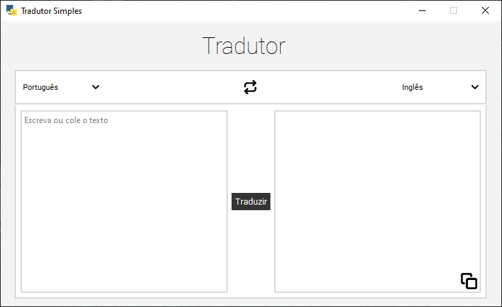

# Tradutor Simples

## Descrição
Um simples tradutor feito em Python3 utilizando a biblioteca GoogleTrans e PySide6 para interface gráfica. 

## Pré-requisitos
Antes de come,ar certifique-se de ter os seguitens programas instalados:
- [Python](https://www.python.org/downloads/) 3.7 ou superior
- [pip](https://pip.pypa.io/en/stable/installation/) para gerenciar pacotes Python

## Instalação
1. **Clone o repositório**
   ```bash
   git clone https://github.com/GSantospy/TradutorSimples.git
   ```
2. Naggeve até o diterótio do projeto
   ```bash
   cd TradutorSimples
   ```
3. Crie e ative um ambiente virtual
No Windows:
   ```bash
   python -m venv venv
   venv\Scripts\activate
   ```
No macOS/Linux
   ```bash
   python3 -m venv venv
   source venv/bin/activate
   ```
5. Instale as dependências
Com o ambiente virtual ativado, instale as dependências necessárias:
    ```bash
    pip install -r requirements.txt
    ```

## Uso
1. Execute o programa
Com o ambiente virtual ativado, execute o programa com o seguinte comando:
    ```bash
    python main.py
    ```
2. Interface

- Texto para traduzir: Insira o texto que deseja traduzir.
- Texto Traduzido: O texto traduzido será exibido aqui.
- Traduzir: Clique no botão central "Traduzir" para traduzir o texto.
- Trocar Idioma: Use o ícone central para alternar rapidamente entre os idiomas de origem e destino.
- Copiar Tradução: Clique no ícone no canto inferior direito para copiar o texto traduzido para a área de transferência.